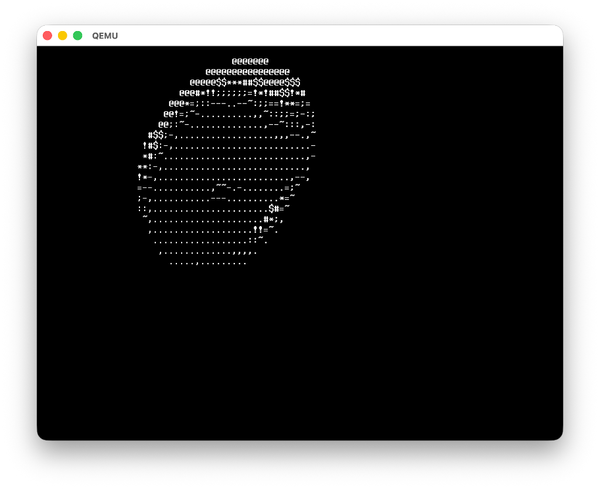

# HELIOS OS

A modern, minimalist 64-bit Operating System for ARM (AArch64).

[](https://github.com/APRK01/HELIOS-OS)
[](https://github.com/APRK01/HELIOS-OS)
[](LICENSE)
[](https://github.com/APRK01/HELIOS-OS/releases)

---

## Overview

HELIOS OS is a hobby operating system built from scratch for the ARM64 architecture. It focuses on simplicity, aesthetics, and clean code. Booted via Limine, it features a robust kernel, a custom shell, and built-in utilities including a text editor and graphical demos.

## Key Features

- **Spinning Donut**: A dedicated command (`donut`) that renders a spinning 3D torus using fixed-point integer arithmetic in ASCII.
- **Interactive Shell**: Featuring command history, line editing, and syntax-highlighted output.
- **Text Editor**: A fully functional, `nano`-style text editor with file saving/loading capabilities.
- **VirtIO Drivers**: Native support for VirtIO GPU (Framebuffer), Keyboard, and Block devices.
- **Memory Management**: Physical Page Allocator (PMM) and Heap allocation (malloc/free).
- **Filesystem**: Virtual Filesystem (VFS) with TmpFS support.

## Demo

### The Shell & Donut


## Getting Started

### Prerequisites

To build and run HELIOS OS, you need:
- `aarch64-elf-gcc` (Cross-compiler)
- `make`
- `xorriso` (For ISO creation)
- `qemu-system-aarch64` (For emulation)

### Building

```bash
git clone https://github.com/APRK01/HELIOS-OS.git
cd HELIOS-OS
make
```

### Running

```bash
make run
```
This will launch QEMU with the generated `helios.iso`.

## Commands

Once in the shell, try:
- `help`: List available commands.
- `desktop`: Launch Plasma Desktop.
- `donut`: Watch the donut spin.
- `edit <file>`: Create or edit a file.
- `fetch`: Show system info with logo.
- `ls`, `pwd`, `echo`, `cat`: Standard interactions.

## Tech Stack

- **Language**: C (Kernel/Userland), Assembly (Boot/Vectors)
- **Bootloader**: Limine
- **Build System**: Makefile
- **Target**: AArch64 (QEMU Virt Machine)

---

Copyright (c) 2026 Advaith Praveen
